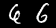
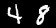
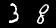
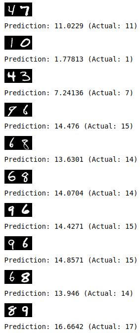

# Performing Arithmetic Using a Neural Network Trained on Images of Digit Permutation Pairs

## Synopsis

In this work, we ask if a network trained with images of digit pairs, and only their summations as labels, can learn to perform the task of addition on unseen digit pairs.

Below is some example input to the network:

| Input                  | Label |
|------------------------|-------|
|     | 4     |
|   | 12    |
|   | 12    |
|   | 11    |

Input to the network is a **single image** containing the concatenation of two MNIST digits, and its label is the **summation of the two digits**.

Here is some sample output of the trained network on **unseen digit pairs**:

Please read the paper for further details of this experiment.

## Paper

This repository contains code to replicate the work described in the following paper: 

Marcus D. Bloice, Peter M. Roth, and Andreas Holzinger. "Performing Arithmetic Using a Neural Network Trained on Digit Permutation Pairs." In _International Symposium on Methodologies for Intelligent Systems (ISMIS 2020)_, pp. 255–264. Springer, 2020. 

See <https://link.springer.com/chapter/10.1007/978-3-030-59491-6_24>

## Reproducibility 

The repository contains a notebook, [MNIST-Calculator.ipynb](./MNIST-Calculator.ipynb), which allows the experiment replicated. _Due to the random nature of the network initialisation, randomised train test splits, and so on, results may not match exactly what was presented in the paper._

**Note:** GitHub sometimes fails to render the notebook. If this is the case try **nbviewer**, which renders the notebook just fine: [https://nbviewer.jupyter.org/github/mdbloice/MNIST-Calculator/blob/main/MNIST-Calculator.ipynb](https://nbviewer.jupyter.org/github/mdbloice/MNIST-Calculator/blob/main/MNIST-Calculator.ipynb?flush_cache=true) 
